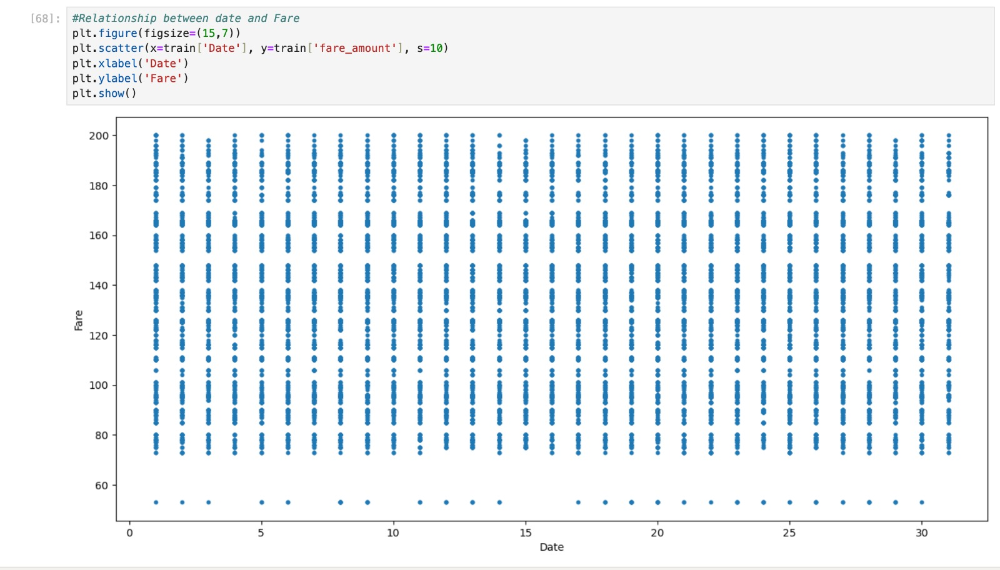
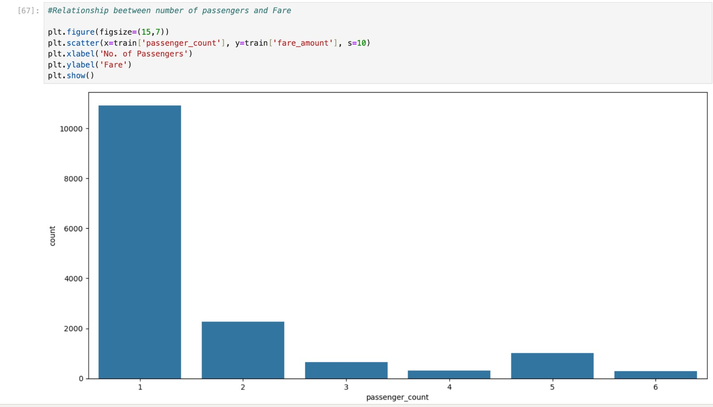
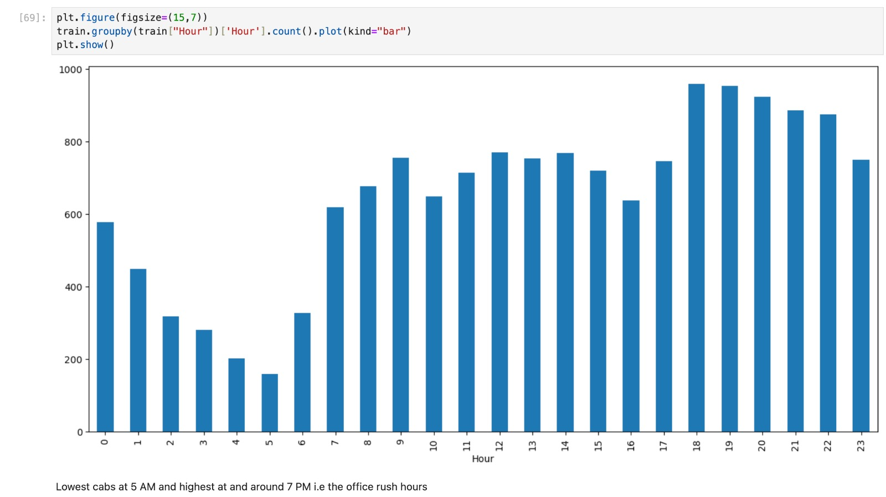
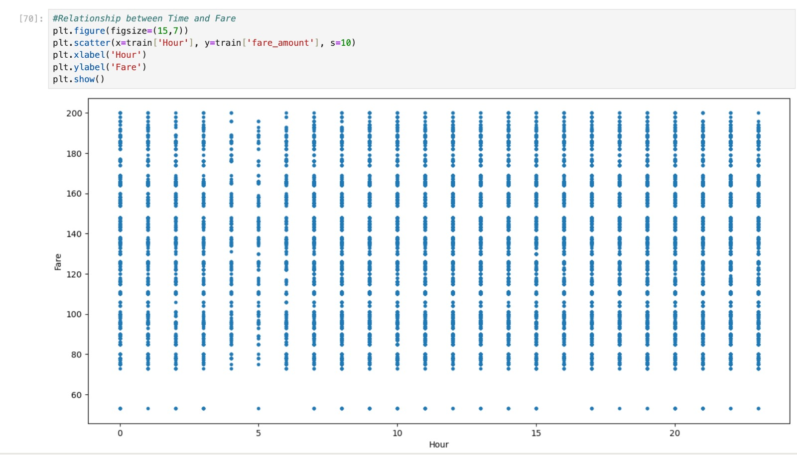
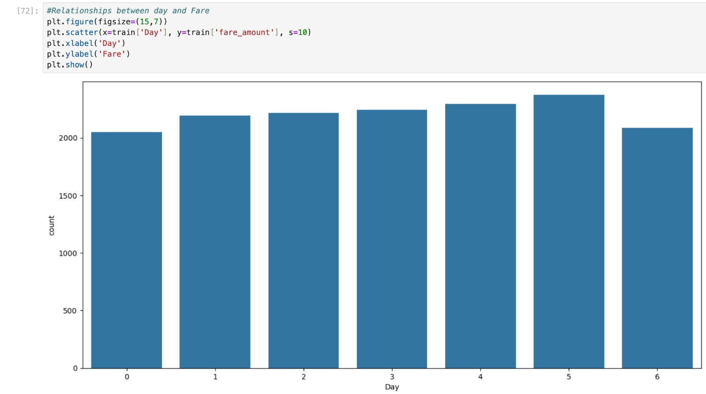
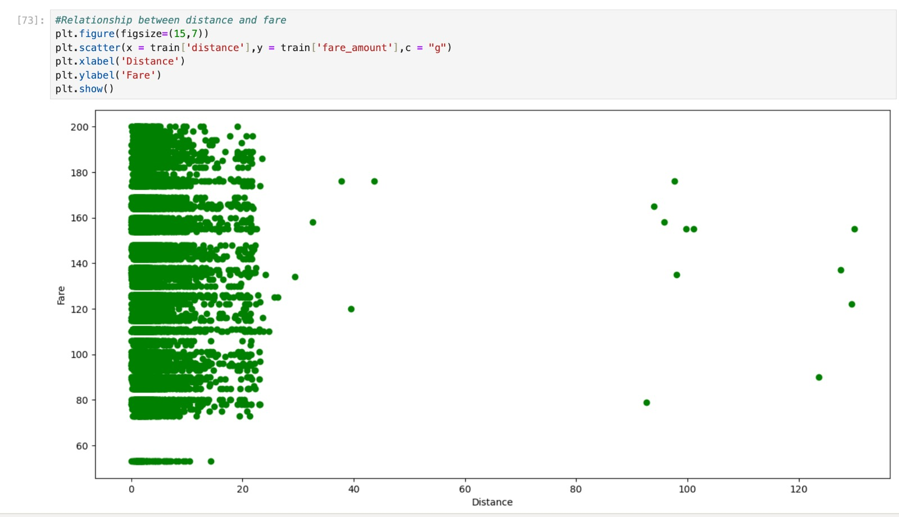
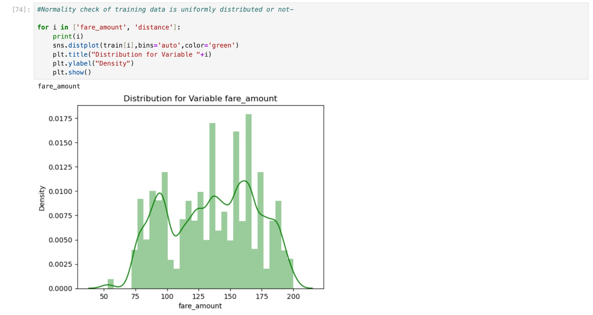
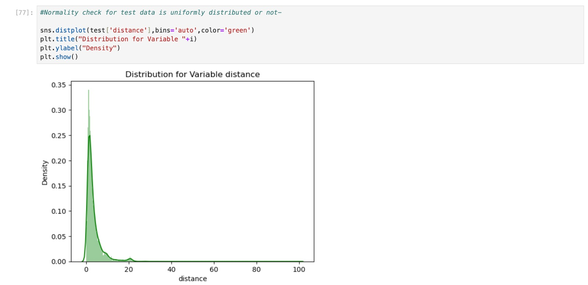
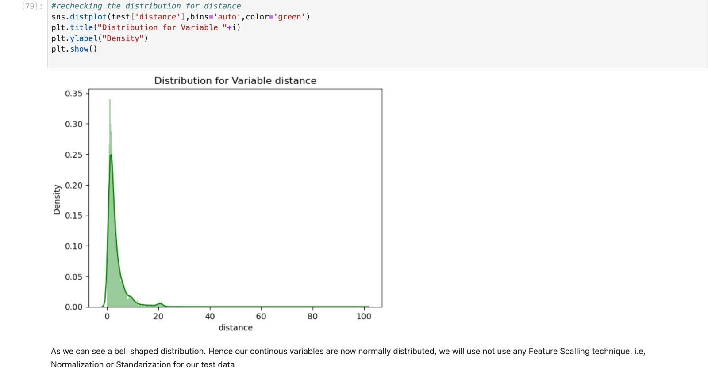
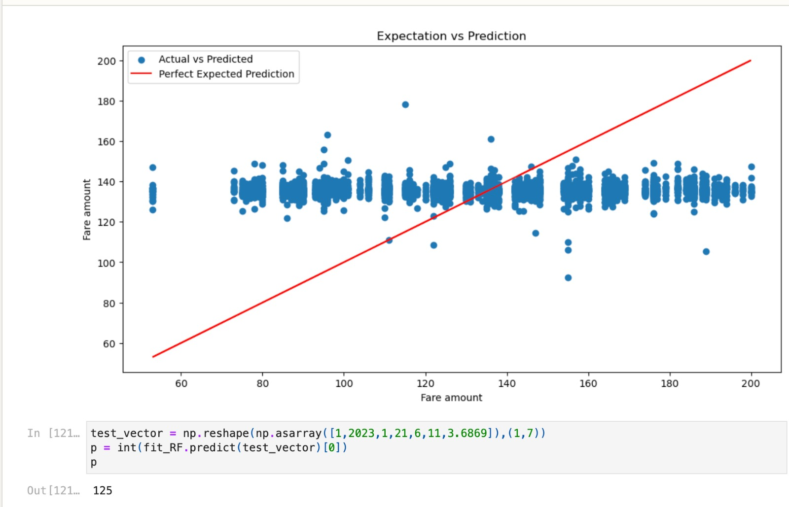

# CAB-FARE-PREDICTION-BASED-ON-TIME-SERIES-WITH-ML-TECHNIQUES_UNDERGRAD_MINI-PROJECT


This project is based on our research work published in **IJIRT, Volume 10, Issue 2 (2023)**. It focuses on predicting cab fares using **time-series analysis** and **machine learning techniques**. The objective is to estimate taxi fares before booking, ensuring fairness, transparency, and protection from overcharging.


## Overview

The taxi service industry has grown rapidly, but fare inconsistency remains a major concern. This project builds a predictive system that uses historical data and dynamic features to estimate the ride fare accurately. The system analyzes factors such as:

* Weather
* Cab availability
* Cab size
* Distance between locations

Using these variables, machine learning models generate reliable fare predictions.


## Features

* Time-series based forecasting
* Trend, seasonality, and residual decomposition
* Multiple ML models implemented:

  * Linear Regression
  * Lasso Regression
  * Random Forest
  * KNN
  * Gradient Boosting
* Supports fare prediction for distances up to 40 km
* Well-structured preprocessing and feature engineering pipeline


## Literature Survey (Summary)

Several previous works inspired this project, including:

* Deep learning frameworks for fare prediction (Xia et al., 2019)
* Time-series models like ARIMA
* Ensemble learning techniques including bagging, boosting, and stacking
* Neural network-based forecasting models

These studies provided a foundation for designing and comparing multiple models in this project.


## System Architecture

### Steps:

1. **Data Collection**
2. **Preprocessing** – handling missing values, removing outliers
3. **Feature Extraction** – year, month, day, hour, distance, passenger count
4. **Training & Testing**
5. **Model Evaluation**

### Core Features Used:

* Passenger count
* Year
* Month
* Date
* Day
* Hour
* Distance (≤ 40 km)


## Machine Learning Models Used

* **Linear Regression**
* **Lasso Regression**
* **Random Forest Regressor**
* **KNN**
* **Gradient Boosting Regressor**
* **Regression Tree (compared but performed less consistently)**

Analysis of results showed that **Multiple Regression** and **Lasso Regression** achieved more stable performance than Regression Trees.


## Time Series Analysis

This project applies time-series techniques including:

* Identifying stationarity
* Detecting trends
* Identifying seasonal patterns
* Decomposition into trend, seasonality, and residual components
* Understanding white noise behavior


## System Requirements

### Hardware:

* Windows 10 or 11
* 4GB RAM or higher

### Software:

* Python 3.x
* Anaconda Navigator
* Jupyter Notebook


## Project Structure

```
Cab-Fare-Prediction/
│── data/
│── notebooks/
│── src/
│── models/
│── README.md
│── requirements.txt
```


## Results

The trained models successfully predicted cab fares using seven major attributes.
The forecasting error rate remained **below industry standard (<5%)**, with Lasso and Multiple Regression models providing the most consistent performance.

## 📊 Visualizations

### 1.Relationship between date and Fare


### 2. Passenger Count Distribution


### 3. Fare Trend Over Time


### 4. Relationship between Time and Fare


### 5. Relationships between day and Fare


### 6. Passenger Count vs Fare


## Feature Scaling:

### 1. Normality check of training data is uniformly distributed or not-


### 2.Normality Re-check to check data is uniformly distributed or not


### 3. Normality check for test data is uniformly distributed or not-


## Result - Time Series Plot 



## Conclusion

The project demonstrates that machine learning techniques combined with time-series analysis can produce accurate cab fare predictions. This helps taxi companies plan better and enhances pricing transparency for users.

📄 Published Research Paper

Read the full paper here:
🔗 https://ijirt.org/article?manuscript=166060

## Authors

**Ayesha Siddiq**
**Shamamah Firdous**
BE (AI & DS),
CS & AI Department,
MJCET, OU Hyderabad, TS, India


### Contact

* [siddiq.a@northeastern.edu](mailto:siddiq.a@northeastern.edu)
*  [firdous.s@northeastern.edu](mailto:firdous.s@northeastern.edu)


